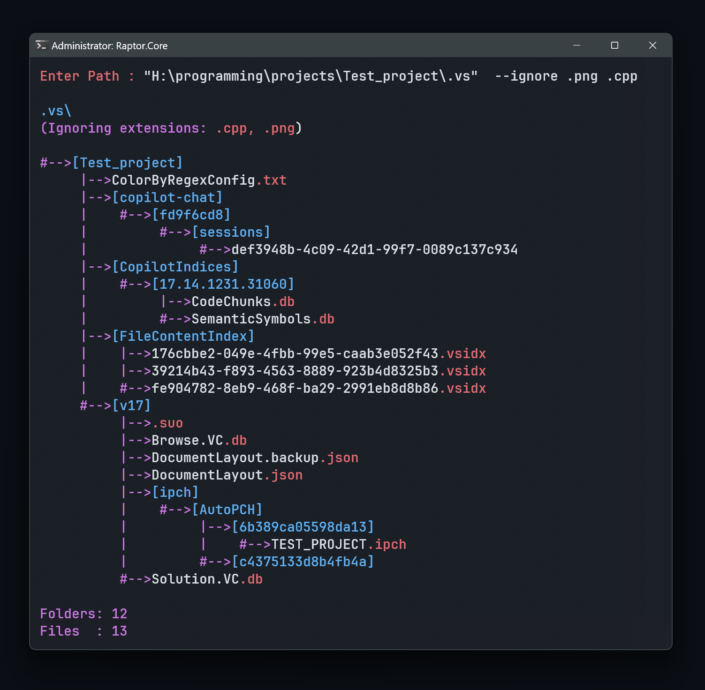

# InterScan

A lightweight, Windows-only, terminal-based **file structure previewer** written in modern C++.

InterScan recursively scans a directory and prints a clean, tree-like view of folders and files with **color-coded output**, optional **file-extension ignoring**, and **robust input parsing**.

> Built for developers who want clarity

---

---
## ✨ Features

* 📁 Recursive directory traversal (full depth)
* 🎨 Color-coded output (folders, tree branches, extensions)
* 🚫 Ignore file extensions via `--ignore` or `--ignore:`
* 🧼 Sanitized and flexible input parsing
* 🪟 Native Windows API (fast, no dependencies)
* ⚡ Single-file project (easy to compile & modify)

---

## 🖥️ Platform Support

* **Windows only** (uses Win32 APIs)
* Tested on Windows 10 / 11

---

## 📦 Project Structure

This is a **single-file project** by design:

```
InterScan/
├── InterScan.cpp
├── README.md
└── .gitignore
```

---

## 🛠️ Build Instructions

### Using g++ (MinGW / MSYS2)

```bash
g++ InterScan.cpp -o interscan -std=c++17
```

### Using MSVC (Developer Command Prompt)

```bat
cl /std:c++17 InterScan.cpp
```

This will generate:

* `interscan.exe`

---

## ▶️ Usage

Run the program and **enter input when prompted**.

```text
Enter Path :
```

You can provide:

* Just a path
* A path + ignore flags
* Quoted paths
* Multiple extensions

---

## ✅ Valid Input Formats

All of the following inputs are **valid and supported**.

### 1️⃣ Path only

```text
H:\programming
```

```text
"H:\My Projects"
```

---

### 2️⃣ Ignore extensions (colon syntax)

```text
H:\programming --ignore: .cpp .json .py
```

```text
H:\programming --ignore:.cpp,.json,.py
```

---

### 3️⃣ Ignore extensions (space syntax)

```text
H:\programming --ignore .cpp .json .py
```

```text
H:\programming --ignore cpp json py
```

---

### 4️⃣ Mixed separators (all valid)

```text
H:\programming --ignore .cpp,.h&.txt
```

```text
H:\programming --ignore cpp, h & txt
```

---

### 5️⃣ Case-insensitive flags

```text
H:\programming --IGNORE .CPP .JSON
```

```text
H:\programming --Ignore: .Cpp .JsOn
```

---

### 6️⃣ Path with quotes + ignore

```text
"H:\My Projects" --ignore .exe .dll
```

---

### 7️⃣ Ignore flag without extensions

```text
H:\programming --ignore
```

➡️ Result: behaves like normal scan (nothing ignored)

---

## 🌳 Output Example

```text
programming\
|-->[assets]
|    |-->logo.png
|    |-->banner.jpg
#-->[src]
     |-->main.cpp
     |-->utils.h
```

* **Folders** are shown in brackets: `[folder]`
* **Extensions** are color-highlighted
* **Tree branches** are visually aligned

---

## 🎨 Console Colors

InterScan uses Windows console color attributes:

| Type       | Color      |
| ---------- | ---------- |
| Folder     | Blue       |
| Tree lines | Magenta    |
| Extensions | Red        |
| Prompt     | Green      |
| Default    | Light Gray |

---

## ⚠️ Notes & Limitations

* Windows-only (uses `windows.h`)
* Symbolic links are treated as files
* Extremely large directories may take time

---

## 🚀 Why InterScan?

InterScan was built to:

* Avoid AI misunderstanding folder structures
* Quickly visualize project layouts
* Replace heavy GUI tools with a fast CLI
* Stay hackable and minimal

---

## 🧠 Future Ideas

* Folder ignore support
* File/folder counters (summary)
* Export tree to text / markdown
* CLI arguments instead of prompt

---

## 📄 License

MIT License — do whatever you want, just don’t blame me 😄

---

## 👤 Author

**BinaryOxide**
GitHub: [https://github.com/BinaryOxide](https://github.com/BinaryOxide)

---

> If it pokes your folders and shows the truth — it did its job.


